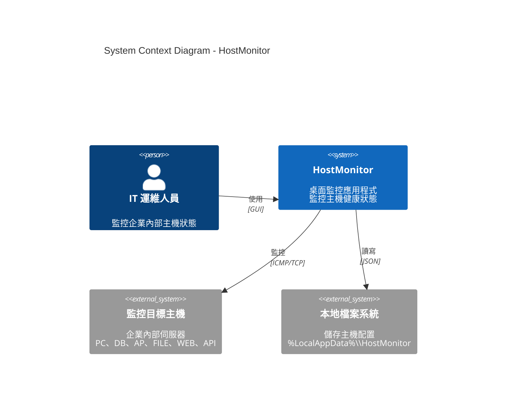
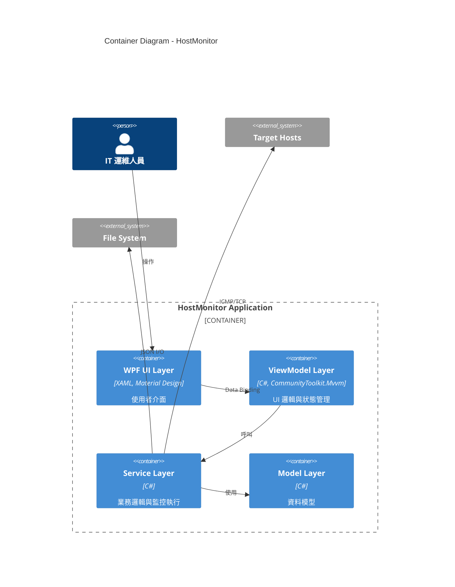
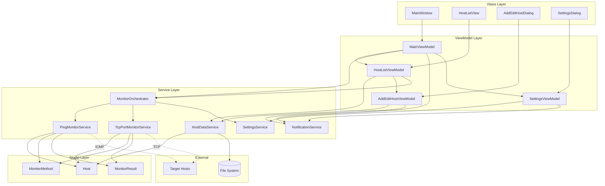
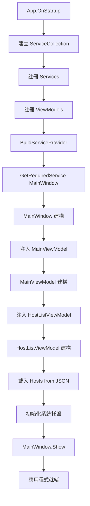
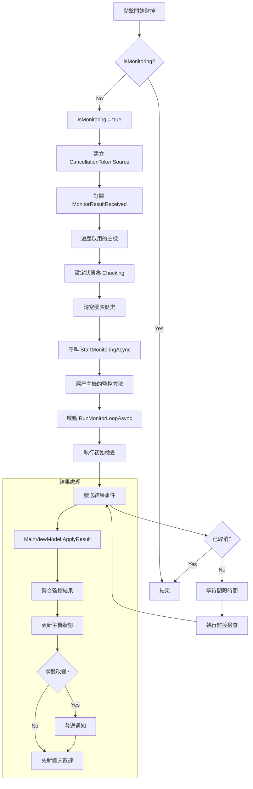
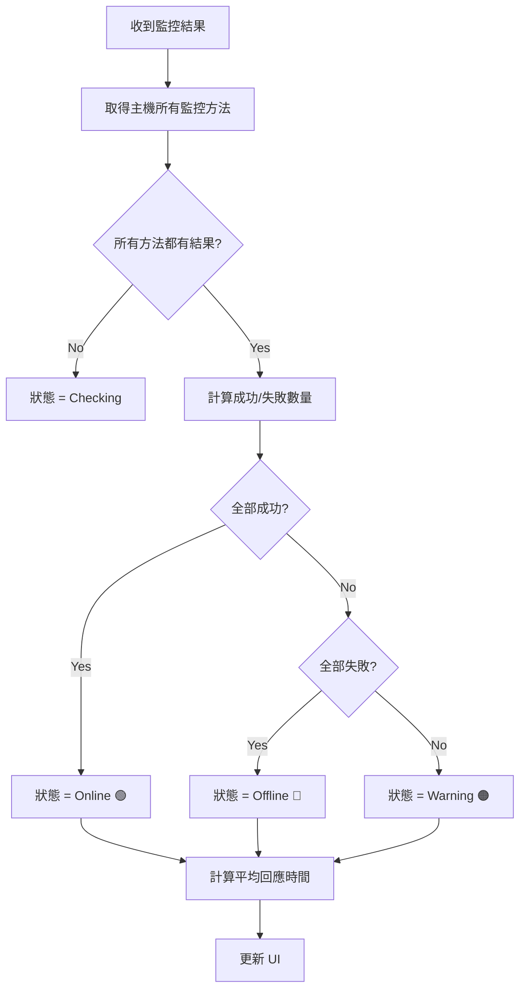
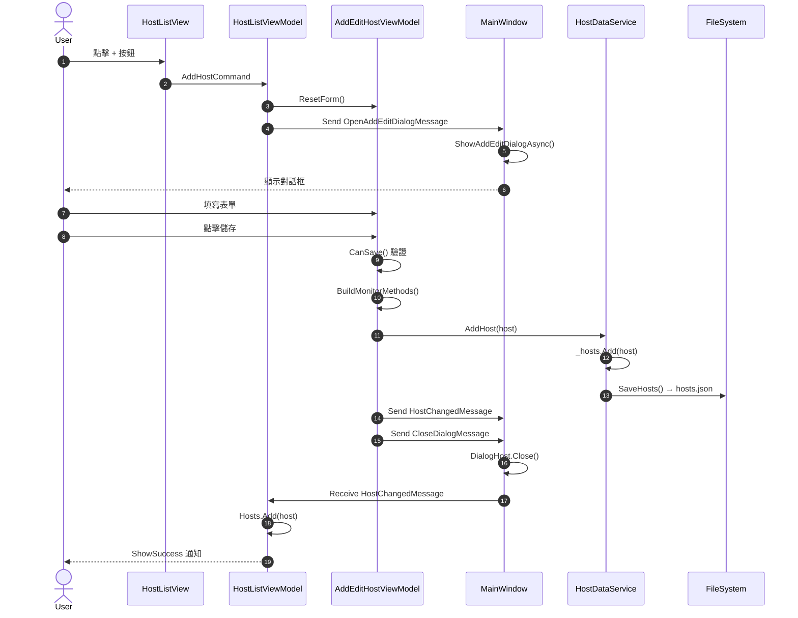
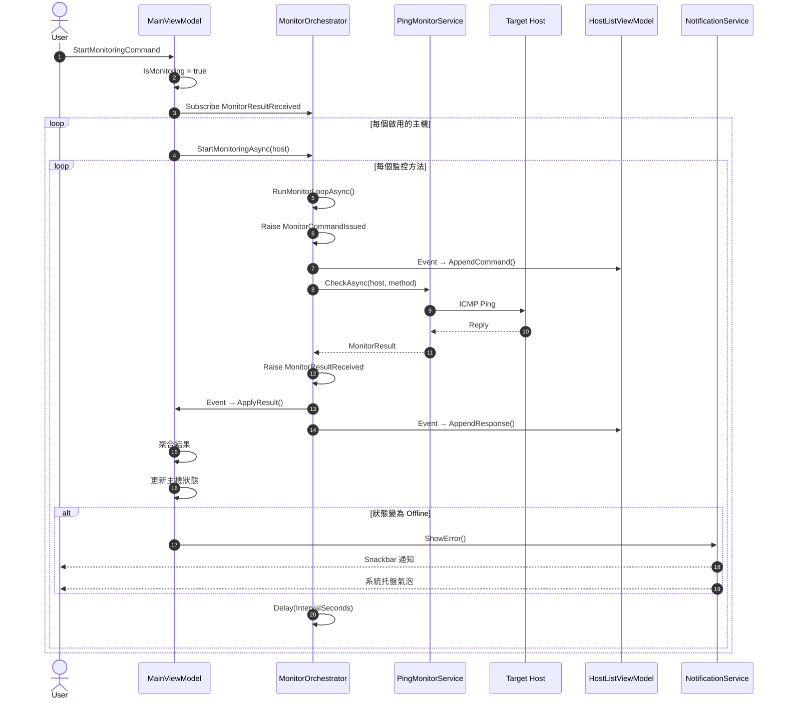
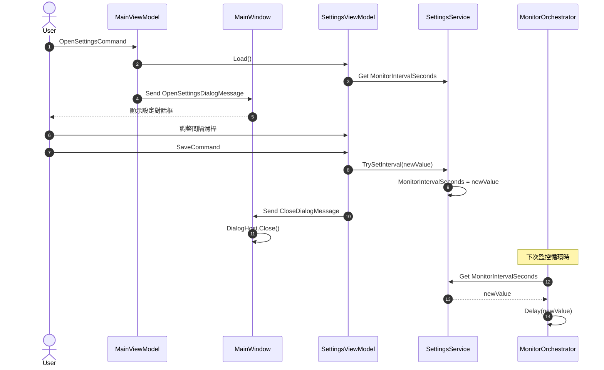

# HostMonitor

<p align="center">
  
</p>

<p align="center">
  <strong>企業級主機監控系統</strong><br>
  即時監控、視覺化圖表、智慧告警
</p>

<p align="center">
  
  
  
  
</p>

---

## 摘要

**HostMonitor** 是一個使用 WPF 開發的桌面應用程式，專為 IT 運維人員設計，提供即時的主機健康狀態監控功能。系統採用 MVVM 架構模式，結合 Material Design 現代化 UI，支援 ICMP Ping 和 TCP Port 兩種監控方式，並提供即時圖表、命令日誌、系統托盤通知等功能。

### 核心價值

- **即時監控**：可配置的監控間隔（1-3600 秒），即時掌握主機狀態
- **多元監控**：支援 ICMP Ping 和 TCP Port 監控，可同時監控多個端口
- **視覺化呈現**：回應時間折線圖、命令執行日誌、狀態顏色指示
- **智慧告警**：離線主機自動通知，支援系統托盤氣泡提示
- **易於管理**：直覺化的主機管理介面，支援新增、編輯、刪除、啟用/停用

---

## 功能特色

### 監控功能

| 功能 | 說明 |
|------|------|
| **ICMP Ping** | 使用 ICMP 協議測試主機可達性和回應時間 |
| **TCP Port** | 測試指定 TCP 端口的連線狀態（如 80, 443, 3389） |
| **批次監控** | 同時監控多台主機，每台可配置多種監控方法 |
| **可配置間隔** | 全域監控間隔設定，1-3600 秒可調 |
| **啟用/停用** | 個別主機可獨立啟用或停用監控 |

### 視覺化功能

| 功能 | 說明 |
|------|------|
| **狀態指示** | 顏色編碼狀態：🟢 在線 / 🔴 離線 / 🟠 警告 / 🔵 檢查中 |
| **回應時間圖表** | 即時折線圖顯示最近 30 次回應時間 |
| **命令日誌** | Mini Console 顯示監控命令和結果 |
| **進度指示** | 檢查中狀態顯示動畫進度條 |

### 通知功能

| 功能 | 說明 |
|------|------|
| **Snackbar 通知** | 應用內即時通知，顯示操作結果 |
| **系統托盤** | 最小化到托盤，右鍵選單控制 |
| **氣泡提示** | 主機離線時顯示系統通知 |
| **週期提醒** | 持續離線主機每 30 秒重複通知 |

### 管理功能

| 功能 | 說明 |
|------|------|
| **主機分類** | 支援 PC、DB、AP、FILE、WEB、API 六種類型 |
| **資料持久化** | 主機配置自動保存至本地 JSON 檔案 |
| **批次操作** | 一鍵開始/停止所有監控 |
| **手動檢查** | 可手動觸發單一主機即時檢查 |

---

## 快速開始

### 系統需求

- Windows 10/11
- .NET 10.0 Runtime
- 建議解析度：1920x1080 或更高

### 安裝步驟

```bash
# 複製專案
git clone https://github.com/your-org/SGS.OAD.MonitR.git

# 進入目錄
cd SGS.OAD.MonitR/HostMonitor

# 還原套件
dotnet restore

# 建置專案
dotnet build

# 執行應用程式
dotnet run
```

### 首次使用

1. 啟動應用程式後，點擊左上角 **+** 按鈕新增主機
2. 填寫主機名稱、Hostname/IP、選擇主機類型
3. 選擇監控方式（Ping 和/或 TCP Port）
4. 點擊右上角 **▶** 按鈕開始監控

---

## 技術架構

### 技術棧

| 類別 | 技術 |
|------|------|
| **框架** | .NET 10.0, WPF |
| **架構模式** | MVVM (Model-View-ViewModel) |
| **MVVM 工具** | CommunityToolkit.Mvvm 8.x |
| **UI 框架** | MaterialDesignThemes 5.x |
| **DI 容器** | Microsoft.Extensions.DependencyInjection |
| **資料格式** | JSON (System.Text.Json) |

### 專案結構

```
HostMonitor/
├── Models/                     # 資料模型
│   ├── Enums/                  # 列舉型別
│   │   ├── HostStatus.cs       # 主機狀態
│   │   ├── HostType.cs         # 主機類型
│   │   └── MonitorType.cs      # 監控類型
│   ├── Host.cs                 # 主機模型
│   ├── MonitorMethod.cs        # 監控方法
│   └── MonitorResult.cs        # 監控結果
│
├── Services/                   # 服務層
│   ├── Interfaces/             # 服務介面
│   ├── Monitoring/             # 監控服務
│   │   ├── MonitorOrchestrator.cs
│   │   ├── PingMonitorService.cs
│   │   └── TcpPortMonitorService.cs
│   ├── HostDataService.cs      # 資料持久化
│   ├── NotificationService.cs  # 通知服務
│   └── SettingsService.cs      # 設定服務
│
├── ViewModels/                 # 視圖模型
│   ├── MainViewModel.cs
│   ├── HostListViewModel.cs
│   ├── AddEditHostViewModel.cs
│   └── SettingsViewModel.cs
│
├── Views/                      # 視圖
│   ├── HostListView.xaml
│   ├── AddEditHostDialog.xaml
│   ├── SettingsDialog.xaml
│   └── ConfirmDeleteDialog.xaml
│
├── Messages/                   # MVVM 訊息
├── Converters/                 # 值轉換器
├── Behaviors/                  # 附加行為
├── Controls/                   # 自訂控制項
└── Assets/                     # 圖示資源
```

---

## 系統架構圖

### C4 Model - Level 1: System Context Diagram



### C4 Model - Level 2: Container Diagram



### C4 Model - Level 3: Component Diagram



---

## 流程圖

### 應用程式啟動流程



### 監控執行流程



### 主機狀態判斷邏輯



---

## 序列圖

### 新增主機流程



### 監控執行序列



### 設定變更序列



---

## 設計模式

### 使用的設計模式

| 模式 | 應用場景 | 說明 |
|------|---------|------|
| **MVVM** | 整體架構 | View ↔ ViewModel ↔ Model 分離 |
| **策略模式** | 監控服務 | IMonitorService 的多種實作 |
| **觀察者模式** | 狀態更新 | ObservableObject, ObservableCollection |
| **命令模式** | UI 操作 | RelayCommand 封裝命令邏輯 |
| **訊息模式** | 元件通訊 | WeakReferenceMessenger 解耦 |
| **儲存庫模式** | 資料存取 | IHostDataService 抽象資料層 |
| **編排器模式** | 監控協調 | MonitorOrchestrator 協調多服務 |
| **依賴注入** | 服務管理 | ServiceCollection + ServiceProvider |

### 策略模式示例

```csharp
// 介面定義
public interface IMonitorService
{
    MonitorType SupportedType { get; }
    Task<MonitorResult> CheckAsync(Host host, MonitorMethod method, CancellationToken ct);
}

// 具體策略
public class PingMonitorService : IMonitorService
{
    public MonitorType SupportedType => MonitorType.IcmpPing;
    // ...
}

public class TcpPortMonitorService : IMonitorService
{
    public MonitorType SupportedType => MonitorType.TcpPort;
    // ...
}

// 策略選擇
public class MonitorOrchestrator
{
    private readonly Dictionary<MonitorType, IMonitorService> _serviceMap;

    public MonitorOrchestrator(IEnumerable<IMonitorService> services)
    {
        _serviceMap = services.ToDictionary(s => s.SupportedType);
    }
}
```

---

## 資料模型

### Host（主機）

```csharp
public class Host : ObservableObject
{
    public Guid Id { get; set; }
    public string Name { get; set; }              // 顯示名稱
    public string HostnameOrIp { get; set; }      // 監控目標
    public string Hostname { get; set; }          // 主機名稱
    public string? IpAddress { get; set; }        // IP 地址
    public HostType Type { get; set; }            // 主機類型
    public List<MonitorMethod> MonitorMethods { get; set; }
    public HostStatus CurrentStatus { get; set; } // 當前狀態
    public DateTime? LastCheckTime { get; set; }  // 最後檢查
    public double? AverageResponseTimeMs { get; set; }
    public string? LastErrorMessage { get; set; }
    public bool IsMonitoringEnabled { get; set; } // 啟用監控
    public ObservableCollection<string> CommandLog { get; }
    public ObservableCollection<double> ResponseTimeHistory { get; }
}
```

### 狀態列舉

```csharp
public enum HostStatus
{
    Unknown,   // 未知（灰色）
    Online,    // 在線（綠色）
    Offline,   // 離線（紅色）
    Warning,   // 警告（橙色）
    Checking   // 檢查中（藍色）
}

public enum HostType
{
    PC,    // 個人電腦
    DB,    // 資料庫伺服器
    AP,    // 應用程式伺服器
    FILE,  // 檔案伺服器
    WEB,   // Web 伺服器
    API    // API 伺服器
}

public enum MonitorType
{
    IcmpPing,  // ICMP Ping
    TcpPort    // TCP 端口
}
```

---

## 設定檔

### 主機資料儲存位置

```
%LocalAppData%\HostMonitor\hosts.json
```

### hosts.json 格式

```json
[
  {
    "Id": "3fa85f64-5717-4562-b3fc-2c963f66afa6",
    "Name": "Web Server",
    "HostnameOrIp": "webserver.local",
    "Hostname": "webserver.local",
    "IpAddress": "192.168.1.100",
    "Type": "WEB",
    "MonitorMethods": [
      {
        "Type": "IcmpPing",
        "IsEnabled": true,
        "Port": null,
        "TimeoutMs": 5000,
        "IntervalSeconds": 5
      },
      {
        "Type": "TcpPort",
        "IsEnabled": true,
        "Port": 443,
        "TimeoutMs": 5000,
        "IntervalSeconds": 5
      }
    ]
  }
]
```

---

## 授權條款

本專案採用 MIT 授權條款。詳見 [LICENSE](LICENSE) 檔案。

---

## 貢獻指南

1. Fork 本專案
2. 建立功能分支 (`git checkout -b feature/amazing-feature`)
3. 提交變更 (`git commit -m 'Add amazing feature'`)
4. 推送分支 (`git push origin feature/amazing-feature`)
5. 建立 Pull Request

---

## 聯絡方式

- **專案維護者**：SGS OAD Team
- **問題回報**：[GitHub Issues](https://github.com/your-org/SGS.OAD.MonitR/issues)

---

<p align="center">
  Made with ❤️ by SGS OAD Team
</p>
