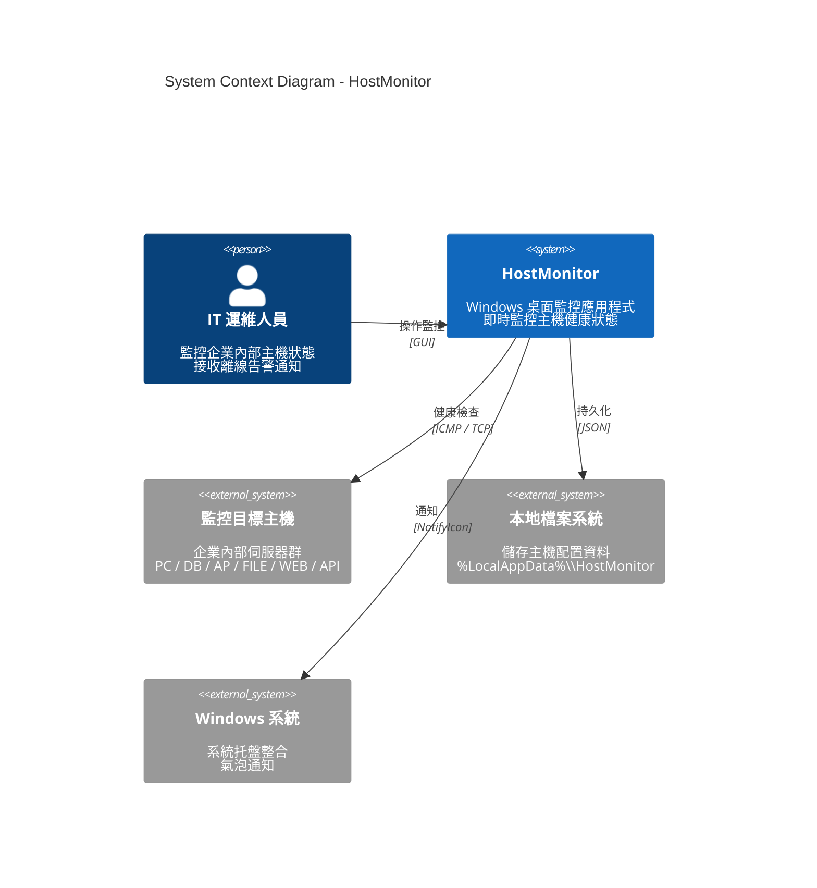
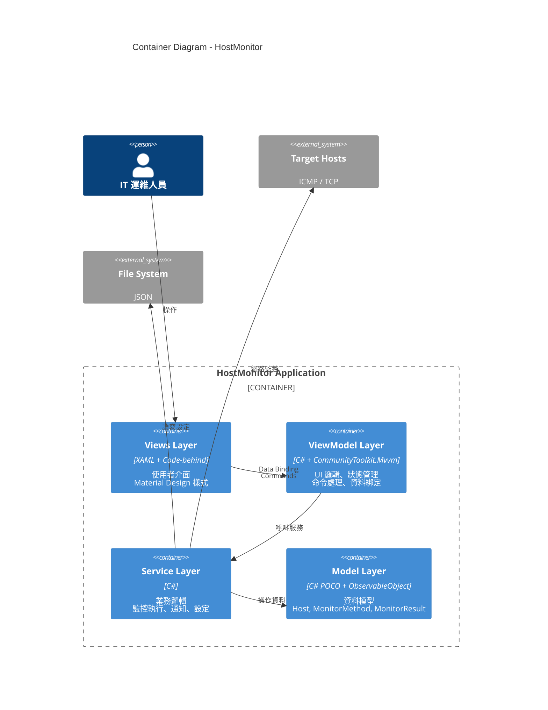
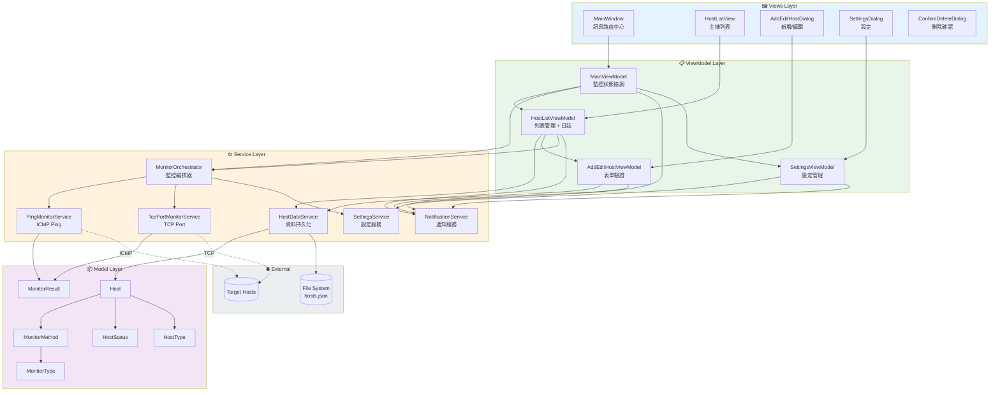
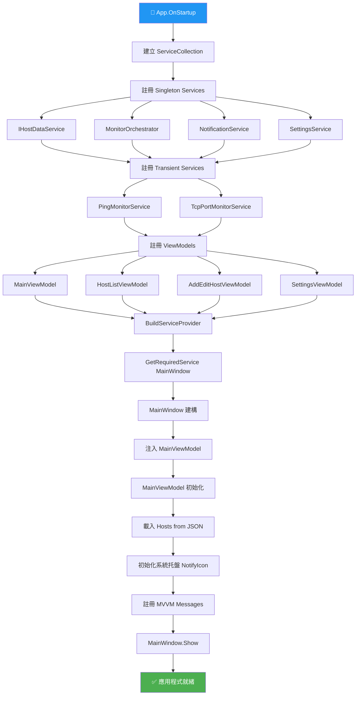
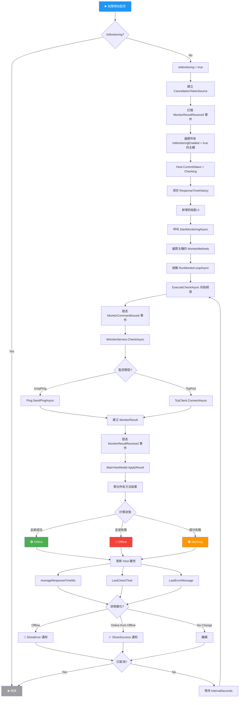
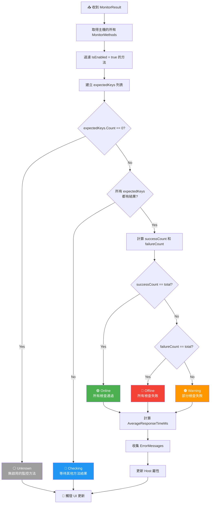
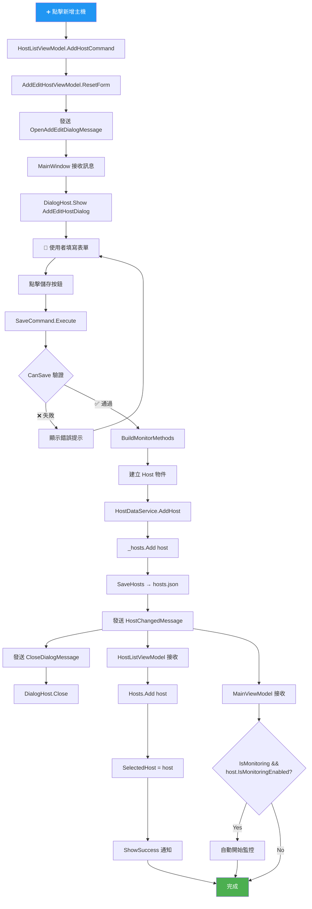
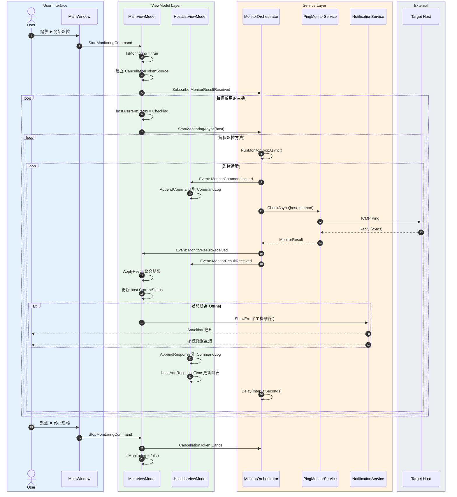
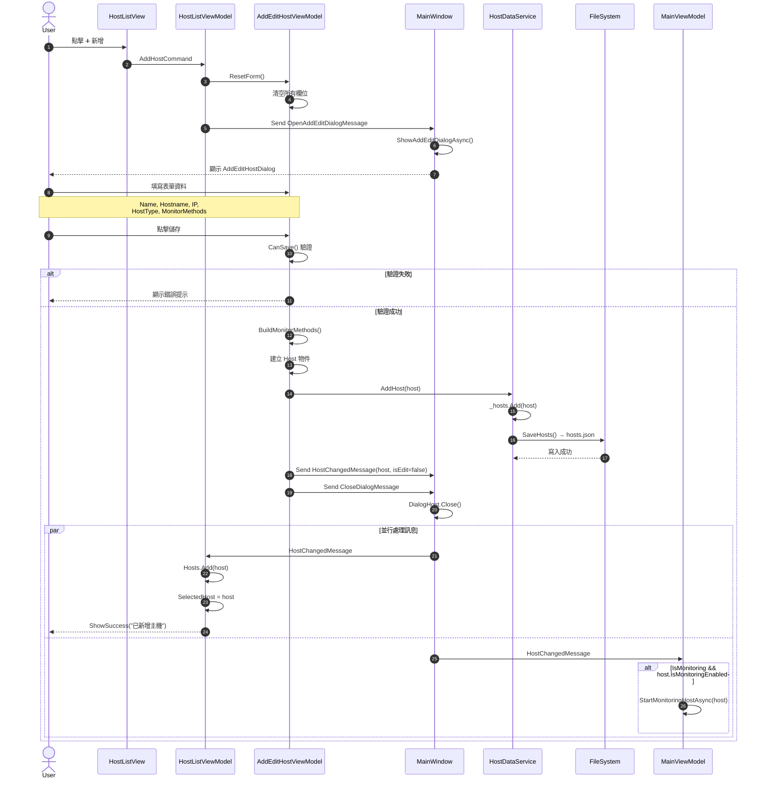
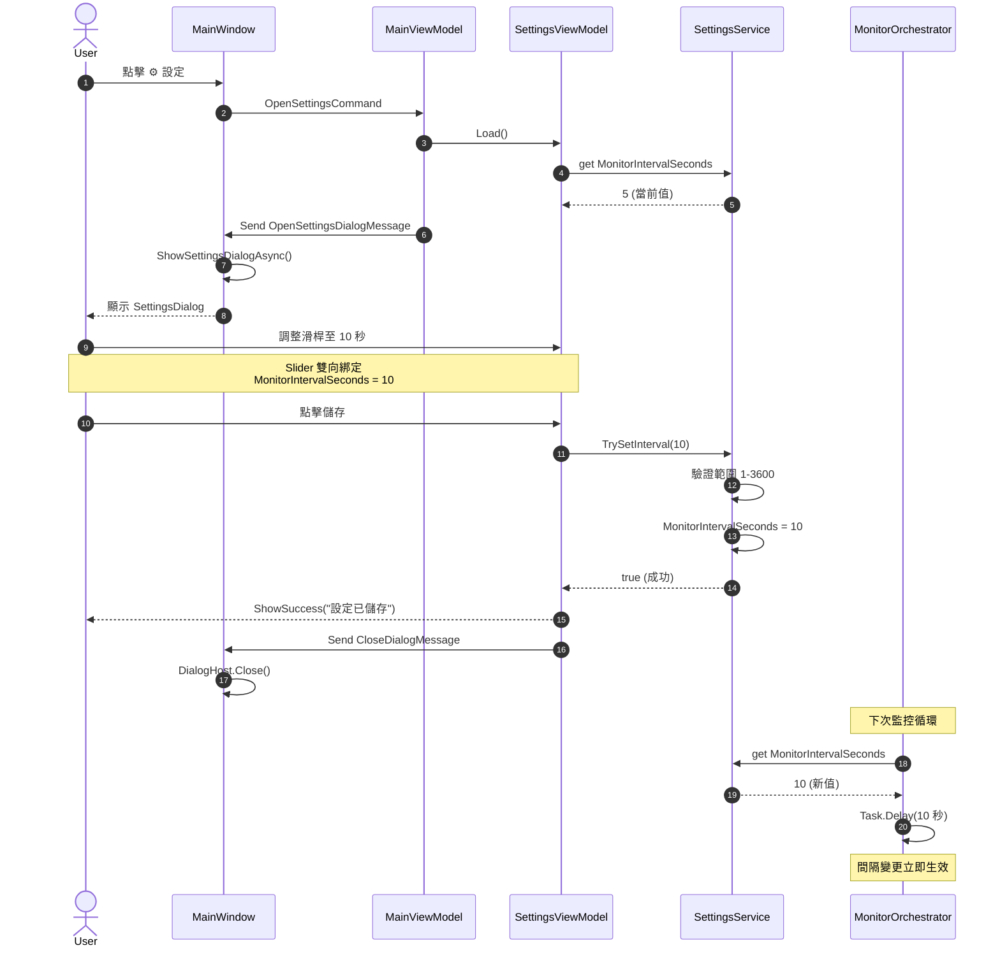

# 🔷 HostMonitor

<p align="center">
  
</p>

<p align="center">
  <strong>🔹 企業級主機監控系統</strong><br>
  <em>即時監控 • 視覺化圖表 • 智慧告警 • 系統托盤整合</em>
</p>

<p align="center">
  
  
  
  
</p>

---

## 🔷 摘要

**HostMonitor** 是一款專為 IT 運維人員設計的 Windows 桌面應用程式，提供企業內部主機的即時健康狀態監控功能。系統採用現代化的 **MVVM 架構模式**，結合 **Material Design** 精美 UI，支援 **ICMP Ping** 和 **TCP Port** 雙重監控方式。

透過直覺化的操作介面，使用者可以輕鬆管理多台主機，即時查看回應時間圖表、命令執行日誌，並在主機離線時收到系統托盤通知。所有監控數據均以視覺化方式呈現，讓 IT 人員能夠快速掌握整體系統健康狀況。

### 🔹 核心亮點

| 特色 | 說明 |
|:---:|------|
| ⚡ | **即時監控** — 可配置 1-3600 秒監控間隔，毫秒級回應偵測 |
| 📊 | **視覺化圖表** — 即時折線圖顯示回應時間趨勢 |
| 🔔 | **智慧告警** — 離線自動通知，支援系統托盤氣泡提示 |
| 🎯 | **精準控制** — 個別主機可獨立啟用/停用監控 |
| 💾 | **資料持久化** — 主機配置自動保存至本地 JSON 檔案 |

---

## 🔷 功能特色

### 🔹 監控功能
- ✅ **ICMP Ping 監控** — 使用 ICMP 協議測試主機可達性和回應時間
- ✅ **TCP Port 監控** — 測試指定 TCP 端口的連線狀態（如 80, 443, 3389, 1433）
- ✅ **多方法監控** — 每台主機可同時配置多種監控方法和多個端口
- ✅ **可配置間隔** — 全域監控間隔設定，1-3600 秒自由調整
- ✅ **獨立控制** — 每台主機可個別啟用或停用監控
- ✅ **手動檢查** — 支援單一主機即時手動觸發檢查

### 🔹 視覺化功能
- 📊 **回應時間圖表** — 自訂折線圖控制項，顯示最近 30 次回應時間
- 🖥️ **命令日誌面板** — Mini Console 風格，顯示最近 200 條監控命令
- 🎨 **狀態顏色指示** — 🟢 在線 / 🔴 離線 / 🟠 警告 / 🔵 檢查中 / ⚪ 未知
- ⏳ **進度動畫** — 檢查中狀態顯示動態進度條
- 🔄 **自動滾動** — 命令日誌自動滾動至最新訊息

### 🔹 通知功能
- 💬 **Snackbar 通知** — 應用內即時通知，支援成功/警告/錯誤三種樣式
- 🔔 **系統托盤整合** — 最小化至托盤，右鍵選單快速控制
- 💡 **氣泡提示** — 主機離線時顯示 Windows 系統通知
- 🔁 **週期提醒** — 持續離線主機每 30 秒重複通知

### 🔹 管理功能
- 🏷️ **主機分類** — 支援 PC、DB、AP、FILE、WEB、API 六種類型標籤
- 📝 **CRUD 操作** — 完整的新增、編輯、刪除主機功能
- 🔍 **搜尋過濾** — 快速搜尋主機名稱
- ⚙️ **設定面板** — 可視化調整監控間隔

---

## 🔷 快速開始

### 🔹 系統需求

| 項目 | 需求 |
|------|------|
| **作業系統** | Windows 10 / 11 (x64) |
| **執行環境** | .NET 10.0 Runtime |
| **建議解析度** | 1920 × 1080 或更高 |
| **記憶體** | 建議 4GB 以上 |

### 🔹 安裝步驟

```bash
# 1. 複製專案
git clone https://github.com/anthropic/SGS.OAD.MonitR.git

# 2. 進入專案目錄
cd SGS.OAD.MonitR/HostMonitor

# 3. 還原 NuGet 套件
dotnet restore

# 4. 建置專案
dotnet build

# 5. 執行應用程式
dotnet run
```

### 🔹 首次使用指南

1. 🚀 啟動應用程式
2. ➕ 點擊左上角 **+** 按鈕新增主機
3. 📝 填寫主機資訊（名稱、Hostname/IP、類型）
4. ☑️ 選擇監控方式（Ping 和/或 TCP Port）
5. ▶️ 點擊右上角 **播放** 按鈕開始監控

---

## 🔷 專案架構

### 🔹 技術棧

| 類別 | 技術 | 版本 |
|------|------|------|
| **框架** | .NET | 10.0 |
| **UI 框架** | WPF (Windows Presentation Foundation) | - |
| **架構模式** | MVVM (Model-View-ViewModel) | - |
| **MVVM 工具** | CommunityToolkit.Mvvm | 8.x |
| **UI 設計** | MaterialDesignThemes | 5.x |
| **DI 容器** | Microsoft.Extensions.DependencyInjection | 10.x |
| **序列化** | System.Text.Json | Built-in |

### 🔹 專案結構

```
HostMonitor/
│
├── 📁 Models/                      # 資料模型層
│   ├── 📁 Enums/                   # 列舉型別
│   │   ├── HostStatus.cs           # 主機狀態 (Unknown/Online/Offline/Warning/Checking)
│   │   ├── HostType.cs             # 主機類型 (PC/DB/AP/FILE/WEB/API)
│   │   └── MonitorType.cs          # 監控類型 (IcmpPing/TcpPort)
│   ├── Host.cs                     # 主機模型 (ObservableObject)
│   ├── MonitorMethod.cs            # 監控方法配置
│   └── MonitorResult.cs            # 監控結果封裝
│
├── 📁 Services/                    # 服務層
│   ├── 📁 Interfaces/              # 服務介面
│   │   ├── IHostDataService.cs     # 主機資料服務介面
│   │   └── IMonitorService.cs      # 監控服務介面 (策略模式)
│   ├── 📁 Monitoring/              # 監控服務實作
│   │   ├── MonitorOrchestrator.cs  # 監控編排器 (協調者模式)
│   │   ├── PingMonitorService.cs   # ICMP Ping 監控
│   │   ├── TcpPortMonitorService.cs# TCP Port 監控
│   │   └── MonitorCommandEventArgs.cs
│   ├── HostDataService.cs          # 主機資料持久化 (JSON)
│   ├── NotificationService.cs      # 通知服務 (Snackbar + Toast)
│   ├── SettingsService.cs          # 設定服務
│   ├── NotificationKind.cs         # 通知類型列舉
│   └── NotificationEventArgs.cs    # 通知事件參數
│
├── 📁 ViewModels/                  # 視圖模型層
│   ├── MainViewModel.cs            # 主視窗 VM (監控狀態協調)
│   ├── HostListViewModel.cs        # 主機列表 VM (CRUD + 日誌)
│   ├── AddEditHostViewModel.cs     # 新增/編輯 VM (表單驗證)
│   └── SettingsViewModel.cs        # 設定 VM
│
├── 📁 Views/                       # 視圖層
│   ├── HostListView.xaml           # 主機列表視圖 (三欄佈局)
│   ├── AddEditHostDialog.xaml      # 新增/編輯對話框
│   ├── SettingsDialog.xaml         # 設定對話框
│   └── ConfirmDeleteDialog.xaml    # 刪除確認對話框
│
├── 📁 Messages/                    # MVVM 訊息 (WeakReferenceMessenger)
│   ├── HostChangedMessage.cs       # 主機變更通知
│   ├── OpenAddEditDialogMessage.cs # 開啟編輯對話框
│   ├── OpenSettingsDialogMessage.cs# 開啟設定對話框
│   ├── ConfirmDeleteHostMessage.cs # 刪除確認請求
│   └── CloseDialogMessage.cs       # 關閉對話框
│
├── 📁 Converters/                  # 值轉換器
│   ├── BoolToVisibilityConverter.cs
│   ├── InverseBoolConverter.cs
│   └── StatusToColorConverter.cs   # 狀態 → 顏色
│
├── 📁 Behaviors/                   # 附加行為
│   └── AutoScrollBehavior.cs       # 自動滾動行為
│
├── 📁 Controls/                    # 自訂控制項
│   └── ResponseTimeChart.cs        # 回應時間圖表 (Canvas + Polyline)
│
├── 📁 Assets/                      # 資源檔案
│   ├── hostmonitor-icon.svg        # 應用程式圖示
│   ├── hostmonitor-icon-small.svg
│   └── hostmonitor-icon-tray.svg
│
├── App.xaml                        # 應用程式定義
├── App.xaml.cs                     # 啟動邏輯 + DI 配置
├── MainWindow.xaml                 # 主視窗
└── MainWindow.xaml.cs              # 訊息路由中心
```

### 🔹 設計模式

| 模式 | 應用場景 | 實作位置 |
|------|---------|---------|
| **MVVM** | 整體架構 | ViewModels ↔ Views |
| **策略模式** | 監控服務 | `IMonitorService` → Ping/TCP |
| **觀察者模式** | 狀態更新 | `ObservableObject`, `ObservableCollection` |
| **命令模式** | UI 操作 | `RelayCommand` |
| **訊息模式** | 元件通訊 | `WeakReferenceMessenger` |
| **編排器模式** | 監控協調 | `MonitorOrchestrator` |
| **儲存庫模式** | 資料存取 | `IHostDataService` |
| **依賴注入** | 服務管理 | `ServiceCollection` |

---

## 🔷 系統架構圖

### 🔹 C4 Model — Level 1: System Context

> 系統上下文圖：展示 HostMonitor 與外部實體的互動關係



### 🔹 C4 Model — Level 2: Container Diagram

> 容器圖：展示應用程式內部的主要分層架構



### 🔹 C4 Model — Level 3: Component Diagram

> 元件圖：展示各層的詳細元件及其依賴關係



---

## 🔷 流程圖

### 🔹 應用程式啟動流程



### 🔹 監控執行流程



### 🔹 主機狀態判斷邏輯



### 🔹 新增主機流程



---

## 🔷 序列圖

### 🔹 監控執行序列



### 🔹 新增主機序列



### 🔹 設定變更序列



---

## 🔷 資料模型

### 🔹 核心模型

```csharp
// Host.cs - 主機模型
public class Host : ObservableObject
{
    public Guid Id { get; set; }                          // 唯一識別碼
    public string Name { get; set; }                      // 顯示名稱
    public string HostnameOrIp { get; set; }              // 監控目標位址
    public string Hostname { get; set; }                  // 主機名稱
    public string? IpAddress { get; set; }                // IP 位址 (選填)
    public HostType Type { get; set; }                    // 主機類型
    public List<MonitorMethod> MonitorMethods { get; set; }// 監控方法列表
    public HostStatus CurrentStatus { get; set; }         // 當前狀態
    public DateTime? LastCheckTime { get; set; }          // 最後檢查時間
    public double? AverageResponseTimeMs { get; set; }    // 平均回應時間
    public string? LastErrorMessage { get; set; }         // 最後錯誤訊息
    public bool IsMonitoringEnabled { get; set; }         // 是否啟用監控
    public ObservableCollection<string> CommandLog { get; }      // 命令日誌 (max 200)
    public ObservableCollection<double> ResponseTimeHistory { get; } // 回應時間歷史 (max 30)
}

// MonitorMethod.cs - 監控方法配置
public class MonitorMethod
{
    public MonitorType Type { get; set; }     // 監控類型
    public bool IsEnabled { get; set; }       // 是否啟用
    public int? Port { get; set; }            // TCP 端口 (TcpPort 類型使用)
    public int TimeoutMs { get; set; } = 5000;// 超時時間 (毫秒)
    public int IntervalSeconds { get; set; } = 5; // 檢查間隔 (秒)
}

// MonitorResult.cs - 監控結果
public class MonitorResult
{
    public Guid HostId { get; set; }          // 主機 ID
    public MonitorType MonitorType { get; set; }// 監控類型
    public bool IsSuccess { get; set; }       // 是否成功
    public long ResponseTimeMs { get; set; }  // 回應時間 (毫秒)
    public DateTime CheckTime { get; set; }   // 檢查時間
    public string? ErrorMessage { get; set; } // 錯誤訊息
    public int? Port { get; set; }            // TCP 端口
}
```

### 🔹 列舉型別

```csharp
// HostStatus.cs
public enum HostStatus
{
    Unknown,   // ⚪ 未知
    Online,    // 🟢 在線
    Offline,   // 🔴 離線
    Warning,   // 🟠 警告 (部分檢查失敗)
    Checking   // 🔵 檢查中
}

// HostType.cs
public enum HostType
{
    PC,    // 個人電腦
    DB,    // 資料庫伺服器
    AP,    // 應用程式伺服器
    FILE,  // 檔案伺服器
    WEB,   // Web 伺服器
    API    // API 伺服器
}

// MonitorType.cs
public enum MonitorType
{
    IcmpPing,  // ICMP Ping
    TcpPort    // TCP 端口
}
```

---

## 🔷 設定與儲存

### 🔹 資料儲存位置

```
%LocalAppData%\HostMonitor\hosts.json
```

### 🔹 hosts.json 格式範例

```json
[
  {
    "Id": "3fa85f64-5717-4562-b3fc-2c963f66afa6",
    "Name": "Web Server",
    "HostnameOrIp": "webserver.local",
    "Hostname": "webserver.local",
    "IpAddress": "192.168.1.100",
    "Type": "WEB",
    "MonitorMethods": [
      {
        "Type": "IcmpPing",
        "IsEnabled": true,
        "Port": null,
        "TimeoutMs": 5000,
        "IntervalSeconds": 5
      },
      {
        "Type": "TcpPort",
        "IsEnabled": true,
        "Port": 443,
        "TimeoutMs": 5000,
        "IntervalSeconds": 5
      }
    ]
  },
  {
    "Id": "a1b2c3d4-e5f6-7890-abcd-ef1234567890",
    "Name": "Database Server",
    "HostnameOrIp": "192.168.1.50",
    "Hostname": "dbserver",
    "IpAddress": "192.168.1.50",
    "Type": "DB",
    "MonitorMethods": [
      {
        "Type": "IcmpPing",
        "IsEnabled": true,
        "Port": null,
        "TimeoutMs": 5000,
        "IntervalSeconds": 5
      },
      {
        "Type": "TcpPort",
        "IsEnabled": true,
        "Port": 1433,
        "TimeoutMs": 5000,
        "IntervalSeconds": 5
      }
    ]
  }
]
```

---

## 🔷 特殊技術實作

### 🔹 自動滾動行為 (AutoScrollBehavior)

```csharp
// 使用附加屬性實現可重用的自動滾動
public static class AutoScrollBehavior
{
    public static readonly DependencyProperty EnableProperty =
        DependencyProperty.RegisterAttached(...);

    // 監聽 CollectionChanged 事件，自動滾動到底部
    private static void OnCollectionChanged(...)
    {
        var scrollViewer = FindScrollViewer(itemsControl);
        scrollViewer?.ScrollToEnd();
    }
}
```

**XAML 使用方式：**
```xml
<ListBox behaviors:AutoScrollBehavior.Enable="True"
         ItemsSource="{Binding CommandLog}" />
```

### 🔹 自訂圖表控制項 (ResponseTimeChart)

```csharp
// 使用 WPF 原生繪圖，不依賴第三方庫
public class ResponseTimeChart : UserControl
{
    private readonly Canvas _canvas;
    private readonly Polyline _line;  // 折線
    private readonly Polygon _fill;   // 填充區域

    // 監聽資料變化重繪圖表
    private void UpdateChart()
    {
        // 1. 計算資料範圍
        // 2. 正規化座標
        // 3. 更新 Polyline 和 Polygon 點集
    }
}
```

### 🔹 非同步確認對話框

```csharp
// 使用 TaskCompletionSource 實現同步等待
var completion = new TaskCompletionSource<bool>();
Messenger.Send(new ConfirmDeleteHostMessage(host, completion));
var confirmed = await completion.Task;  // 等待使用者確認
```

---

## 🔷 授權條款

本專案採用 **MIT 授權條款**。

```
MIT License

Copyright (c) 2024 SGS OAD Team

Permission is hereby granted, free of charge, to any person obtaining a copy
of this software and associated documentation files (the "Software"), to deal
in the Software without restriction, including without limitation the rights
to use, copy, modify, merge, publish, distribute, sublicense, and/or sell
copies of the Software...
```

---

## 🔷 貢獻指南

我們歡迎所有形式的貢獻！

### 🔹 如何貢獻

1. **Fork** 本專案
2. 建立功能分支 (`git checkout -b feature/amazing-feature`)
3. 提交變更 (`git commit -m 'Add amazing feature'`)
4. 推送分支 (`git push origin feature/amazing-feature`)
5. 建立 **Pull Request**

### 🔹 程式碼規範

- 遵循 C# 命名慣例
- 使用 `///` XML 文件註解
- 維持 MVVM 架構分離
- 新增功能請附帶單元測試

---

## 🔷 聯絡方式

| 管道 | 連結 |
|------|------|
| **專案維護** | SGS OAD Team |
| **問題回報** | [GitHub Issues](https://github.com/anthropic/SGS.OAD.MonitR/issues) |
| **功能建議** | [GitHub Discussions](https://github.com/anthropic/SGS.OAD.MonitR/discussions) |

---

<p align="center">
  
  <br><br>
  <strong>HostMonitor</strong><br>
  <em>Made with 💙 by SGS OAD Team</em>
</p>
